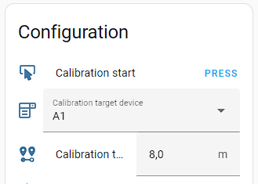
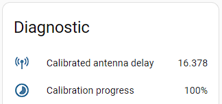

# Antenna delay calibration

In order to optimize UWB ranging results, the delay in transmission (TX) and reception (RX) of an UWB frame caused by the **antenna** can be calibrated.

Makerfabs ESP32 UWB DW3000 devices are typically **not calibrated** at factory line. In all my devices the One-Time-Programmable OTP reserved by Decawave/Qorvo for storing the antenna calibration result at factory time was empty.

Generally, the TX and RX antenna delay are different. Refer to Decawave/Qorvo document 'Antenna Delay Calibration of DW1000-Based Products and Systems (Application Note APS014)' available from https://www.qorvo.com/products/p/DWM3000#documents.

This implementation treats TX and RX antenna delay always **same**, both in calibration and also in ranging.

## How it works

For antenna delay calibration, 2 devices are needed
* 1x `tag`
* 1x `anchor`

The 2 devices are placed in direct line of sight in a precisely known distance to each other, referred to here as `target distance`.

The calibration procedure changes the TX and RX antenna delay of both tag and anchor device until it finds the UWB ranging measurement result to be as close as possible to the `target distance`.

The antenna delay value range is unsigned 16-bit (0 ... 32767). In experiments I found that:
* smaller values result in larger ranging results,
* the target distance has no significant influence on the antenna delay calibration.

A **modified binary search** is used for searching the optimal antenna delay.<br>
Start range is [0, 32768] with initial value 16384.<br>
A round of 10 ranging measurements is collected using this antenna delay value.<br>
If the average distance of the 10 measurements is lower than the target distance, then the next antenna delay value will be decreased, else increased.<br>
A _traditional_ binary search would select the next value by cutting the range in half, using the lower or upper half dependent on the previous decision to ìncrease or decrease and then choose the next antenna delay value from the middle of the range. This approach works well when the measurement is reliable and reproducible, which is not the case in real-world UWB ranging.<br>
Therefore a _modified_ binary search is implemented. It still cuts the range in half, but then cuts this range in thirds and chooses the lower range value dependent on the decision to increase or decrease as being 2 thirds lower (decrease) or 1 thirds lower (increase) than the previous antenna delay value. The upper range value is assigned as 1 third (decrease) or 2 thirds higher than the previous antenna delay value.

**Example**

Assumed `target distance` = 10m.

| Round | Antenna delay value | Range | Avg distance measurement | Decisions for next round |
| :-: | :-: | :-: | :-: | :-: |
| 1 | 16384 | [0, 32768] | 9.5 | **Decrease** (dist<target) <br>next range size: (32767-0)/2=16384<br>**lower**: 16384-2*(16384/3)=**5462**<br>**upper**: 16384+1*(16384/3)=**21845**<br>**AntDelay**: (21845+5462)/2=**13653**|
| 2 | 13653 | [5462, 21845] | 10.5 | **Increase** (dist>target)<br>next range size: (21845-5462)/2=8191<br>**lower**: 13653-1*(8191/3)=**10923**<br>**upper**: 13653+2*(8191/3)=**19113**|
| 3 | 15018 | [10923, 19113] | 10.2 | Increase (dist>target)<br>[...]|
| ... | ... | ... | ... | ... |
| 16 | X | [X, X] | ... | **Done**<br>X = calibration result |

After 16 rounds (2<sup>16</sup>=32768=initial range size) the search will terminate.<br>
This whole procedure is **repeated 5 times** and will take approximately **3 minutes**.<br>

Finally, the **calibrated** antenna delay is reported to **Home Assistant**. See `antenna_calibration_delay_result` in [Full Documentation](full-documentation.adoc).

The calibrated antenna delay is **not stored** on the Makerfabs ESP32 UWB DW3000 device. In order to tell the device to use this value, set `antenna_delay` in `uwb` section of ESPHome YAML. Refer to [Full Documentation](full-documentation.adoc).

## How to perform antenna delay calibration

The `tag` device is the 'active' device and steers the anchor device using Initial message `FunctionCode = ANT_DELAY_CALIBRATION` (see [How it works](how-it-works.md)).

The `anchor` device requires no special configuration.

### `tag` configuration

When adding below configuration to the `tag` ESPHome YAML configuration, additional **disabled** entities will show up in Home Assistant.<br>
In Home Assistant the entities must be enabled by the User before these can be used.

```
uwb:
  role: tag
  [...]

sensor:
  # antenna delay calibration result
  - platform: uwb
    antenna_calibration_delay_result:
      id: antenna_calibration_delay_result
      name: Calibrated antenna delay
  # Optional: antenna delay calibration progress in percent
  - platform: uwb
    antenna_calibration_progress:
      id: antenna_calibration_progress
      name: Calibration progress

number:
  # target distance
  - platform: uwb
    antenna_delay_calibration_distance:
      id: antdelay_calibration_distance
      name: Calibration target distance

select:
  # anchor device selection
  - platform: uwb
    antenna_delay_calibration_device:
      id: antenna_delay_calibration_device
      name: Calibration target device

button:
  # Start button
  - platform: uwb
    antenna_delay_calibration_start:
      id: antenna_delay_calibration_start
      name: Calibration start
```

### Home Assistant

#### Preparations

1. First enable all the above entities in the `Configuration' and 'Diagnostic' area.<br>
2. Then select the **Calibration target device** to use from the drop-down of all configured anchors.<br>
3. Then enter the **Calibration target distance**.
4. Press the **Calibration Start** button.<br>
   A started calibration procedure cannot be aborted.<br>
   Rebooting the `tag` device after calibration started does not harm. The device does not re-enter calibration automatically.



#### Result

When calibration procedure has finished, the result is available in Home Assistant under 'Diagnostic'.<br>
16378 is just an example, not an advice to use this value.



It is adviced to repeat antenna delay calibration with different anchors and different target distances.<br>

The **Calibrated antenna delay** can then be configured to `tag` and `anchor` devices with `antenna_delay` in `uwb` section of ESPHome YAML. Refer to [Full Documentation](full-documentation.adoc).

In my experiments I noticed that a very small change of the tag location (while keeping target distance same) results in slightly different calibration results of about +/- 10.<br>
IC temperature and IC voltage differences seem to not impact antenna delay calibration significantly.<br>
Different anchor devices with always same tag device did also not lead to significant differences.
