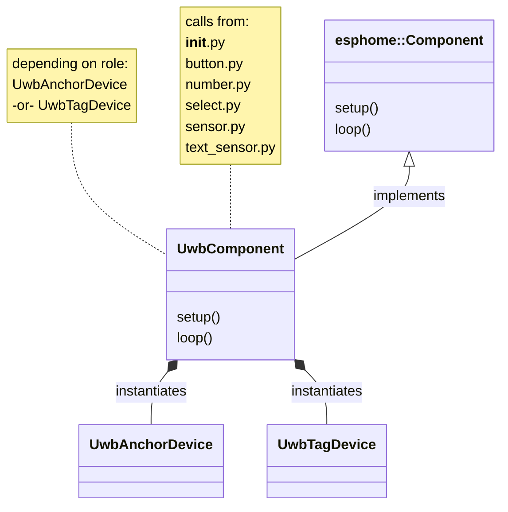
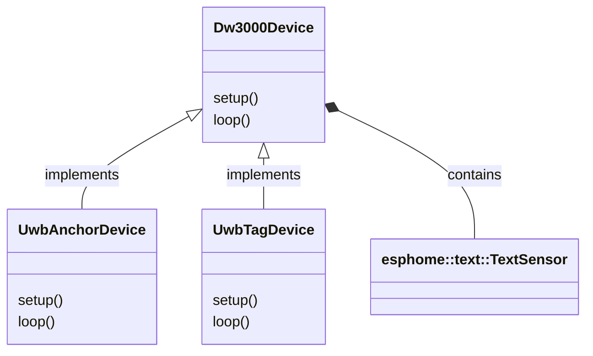
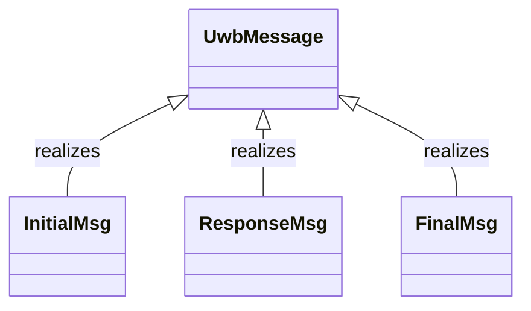
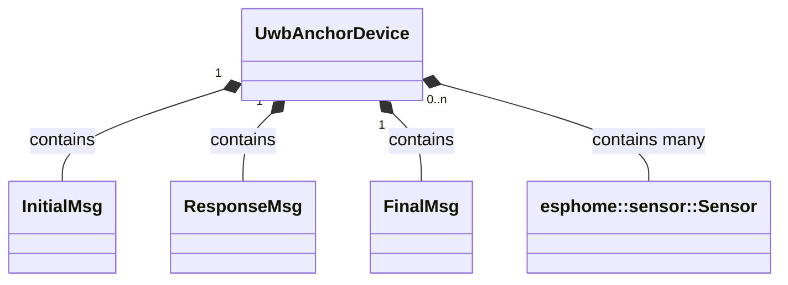
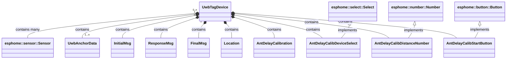

# Source code documentation

## Class overview

### UwbComponent

Class `UwbComponent` implements `esphome::Component` and receives `setup()` and `loop()` calls from ESPHome framework.

In `setup()` it processes the ESPHome YAML configuration calls from Python code, instantiates either `UwbAnchorDevice` or `UwbTagDevice` (`Dw3000Device` sub classes) according to `role`, sets any configured sensors on the instance and calls `setup()` on it.

`loop()` calls the `loop()` of the `Dw3000Device` subclass instance.

### Dw3000Device

Class `Dw3000Device` is the base class of `UwbAnchorDevice` and `UwbTagDevice`.

It contains common `esphome::text::TextSensor`s, if configured in ESPHome YAML, and allows the sub classes to use those.

`Dw3000Device` performs common initialization of the DW3000 IC and implements common code used by `UwbAnchorDevice` and `UwbTagDevice`.

### UwbMessage

`UwbMessage` is the base class for the 3 types of UWB frames/messages used: `InitialMsg`, `ResponseMsg`, `FinalMsg`.

Refer to [How it works](how-it-works.md) for detailed description of messages.

### UwbAnchorDevice

Class `UwbAnchorDevice` is the main implementation of role `anchor`.

It contains a complex state machine for handling incoming UWB ranging or antenna delay calibration requests from `UwbTagDevice`.

### UwbTagDevice

Class `UwbTagDevice` is the main implementation of role `tag`.

It contains a complex state machine for initiating UWB ranging or antenna delay calibration with all of configured `UwbAnchorDevice`s.

### UwbAnchorData

An instance of `UwbTagDevice` contains an **array** of `UwbAnchorData`, which each hold data about one of the configured anchors like its statically configured latitude/longitude and device ID, as well as runtime measured distance and distance error estimate.

`UwbAnchorData` holds the distance sensor for reporting to Home Assistant.

### Location

An instance of `UwbTagDevice` contains a `Location` instance as a helper class to calculate the tag's WGS 84 position and the Haversine distance between two WGS 84 positions on earth.

`Location` implements all of the concept described in [How it works](how-it-works.md) regarding calculation of the `tag` location.

### AntDelayCalibration

An instance of `UwbTagDevice` contains an `AntDelayCalibration` instance as a helper class for performing the calculations needed during an antenna delay calibration. Refer to [Antenna delay calibration](ant-delay-calibration.md) for more details.

## Sequence of UWB messages between `tag` and `anchor`s

> **Note**
> Method names in below sequence do appear in code.
> Error handling is not shown.

```mermaid
sequenceDiagram
  participant Tag as UwbTagDevice
  participant Anchor as UwbAnchorDevice
  participant HA as HomeAssistant

  loop forever
    par
      Note over Tag: time configurable:<br/>ranging_interval_ms
      activate Tag
      Tag->>Tag:waitNextRangingInterval()
      deactivate Tag
    and
      activate Anchor
      Anchor->>Anchor:prepareWaitRecvInitial()
      deactivate Anchor
      loop forever
        activate Anchor
        Anchor->>Anchor:waitRecvInitial()
        deactivate Anchor
      end
    end
    loop for all configured anchors of tag
      activate Tag
      Tag->>Tag:waitNextAnchorRanging()
      deactivate Tag
      activate Tag
      Tag->>Tag:prepareSendInitial()
      Tag->>Anchor:InitialMsg
      Note right of Anchor: RX frame buffered<br>in DW3000 IC
      Tag->>Tag:sentInitial()
      deactivate Tag
      Note over Tag: WAIT_RX_TIMEOUT_MS = 100 microseconds
      par
        loop WAIT_RX_TIMEOUT_MS
          activate Tag
          Tag->>Tag: waitRecvResponse()
          deactivate Tag
        end
      and
        activate Anchor
        Anchor->>Anchor:recvdFrameInitial()
      end
      Anchor->>Tag:ResponseMsg
      Note left of Tag: RX frame buffered<br>in DW3000 IC
      activate Tag
      Anchor->>Anchor:sentResponse()
      deactivate Anchor
      Note over Anchor: WAIT_RX_TIMEOUT_MS = 100 microseconds
      par
        loop
          activate Anchor
          Anchor->>Anchor:waitRecvFinal()
          deactivate Anchor
        end
      and
        activate Tag
        Tag->>Tag:recvdFrameResponse() {
      end
      Tag->>Anchor:FinalMsg
      Note right of Anchor: RX frame buffered<br>in DW3000 IC
      Tag->>Tag:sentFinal()
      deactivate Tag
      Note over Tag: WAIT_RX_TIMEOUT_MS = 100 microseconds
      par
        loop WAIT_RX_TIMEOUT_MS
          activate Tag
          Tag->>Tag:waitRecvFinal()
          deactivate Tag
        end
      and
        activate Anchor
        Anchor->>Anchor:recvdFrameFinal()
      end
      Anchor->>Tag:FinalMsg
      Note left of Tag: RX frame buffered<br>in DW3000 IC
      Anchor->>Anchor:sentFinal()
      opt if configured
        Anchor->>HA:publish_state(distance anchor to tag)
      end
      deactivate Anchor
      activate Tag
      Tag->>Tag:recvdFrameFinal()
      Tag->>Tag:rangingDone()
      deactivate Tag
    end # loop over all anchors

    activate Tag
    Tag->>Tag:calculateLocationPrepare()
    deactivate Tag
    Note left of Tag: enum CalculationPhase:<br>ANCHOR_COMBINATIONS<br>COLLECT_CANDIDATES<br>FILTER_CANDIDATES<br> SELECT_BEST_CANDIDATE
    loop foreach phase
      activate Tag
      Tag->>Tag:calculateLocationInPhases(phase)
      deactivate Tag
    end
    activate Tag
    Tag->>Tag:locationPostProcessing()
    Tag->>HA:publish_state(latitude)
    activate HA
    Tag->>HA:publish_state(longitude)
    opt if configured
      Tag->>HA:publish_state(error_estimate)
      Tag->>HA:publish_state(anchors_in_use)
      loop for each anchor
        Tag->>HA:publish_state(distance tag to anchor)
      end
    end
    deactivate Tag
    deactivate HA
  end # loop forever
```

