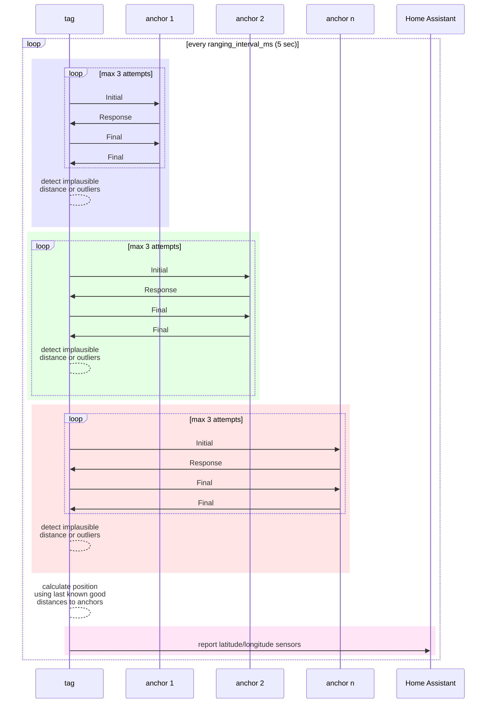
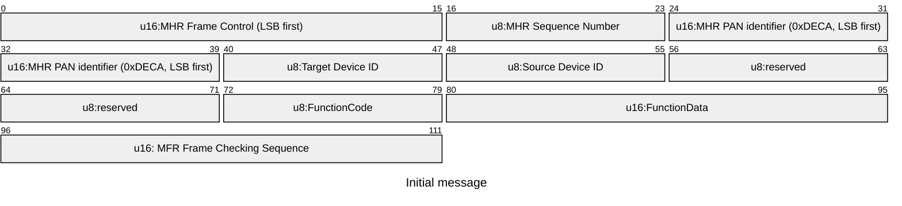
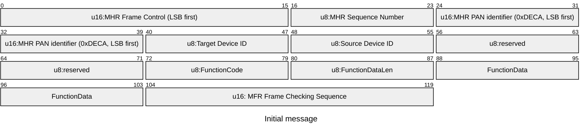
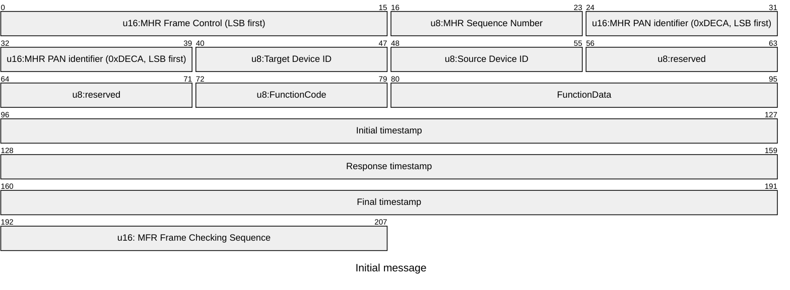

# How it works

The `tag` device is performing UWB ranging with the `anchor` devices, calculates its position using the known positions of the `anchor` devices and communicates its position to Home Assistant over WiFi.

## UWB ranging

Every `ranging_interval_ms` (configurable, default 5 s) the `tag` iterates over all configured `anchor` devices and performs UWB ranging.

UWB ranging is implemened as Dual-Sided Two-Way-Ranging (DS-TWR) with 4 messages. It does not use encryption (non-STS). Following 3 types of messages are used:

* Initial : Triggers `anchor` to return a Response.
* Response : Response back to `tag`.
* Final : Carries timestamps of reception/transmission of Initial, Response and Final message.

With the three timestamps included in Final message, both anchor and tag ('Dual-Sided') can calculate the Time-Of-Flight (TOF) and therefore the distance between each other, without any need to synchronize their internal clocks.

All messages follow IEEE 802.15.4 UWB standard, but are proprietary in their payloads.

Configuration of the DW3000 IC:

* Channel 5 (6.5 GHz)
* Data rate 6.81 Mb/s

### Message sequence

## UWB frames/messages

**Legend** 
MHR: MAC Header 
MFR: MAC Footer 
LSB: Least Significant Byte 
PAN: Personal Area Network

### Initial message

Frame size is 14 bytes.

### Response message

Frame size is 15 bytes.

### Final message

Frame size is 26 bytes.

