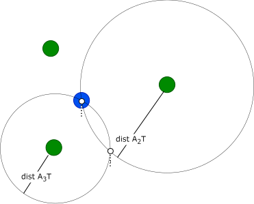

# How it works

The `tag` device is performing UWB ranging with the `anchor` devices, calculates its position using the known positions of the `anchor` devices and communicates its position to Home Assistant over WiFi.

## UWB ranging

Every `ranging_interval_ms` (configurable, default 5 s) the `tag` iterates over all configured `anchor` devices and performs UWB ranging.

UWB ranging is implemened as Dual-Sided Two-Way-Ranging (DS-TWR) with 4 messages. It does not use encryption (non-STS). Following 3 types of messages are used:

* Initial : Triggers `anchor` to return a Response.
* Response : Response back to `tag`.
* Final :
  - Timestamps of reception/transmission of Initial, Response and Final message,
  - If Final message sent from `anchor` to `tag`: Distance calculated by `anchor`.

With the 3 timestamps included in Final message, both anchor and tag ('Dual-Sided') can calculate the Time-Of-Flight (TOF) and therefore the distance between each other, without the need to synchronize their internal clocks.

With the distance measured by the `anchor` transmitted with the Final message, and the `tag` own measured distance, the `tag` can estimate the error in meters for its calculated position.

All messages follow IEEE 802.15.4 UWB standard, but are proprietary in their payloads.

Configuration of the DW3000 IC:

* Channel 5 (6.5 GHz)
* Data rate 6.81 Mb/s

### Message sequence

## UWB frames/messages

**Legend** 
MHR: Medium Access (MAC) Header 
MFR: Medium Access (MAC) Footer 
LSB: Least Significant Byte 
MSB: Most Significant Byte 
PAN: Personal Area Network 

### Initial message

Frame size is 14 bytes.

FunctionCode definition:
* RANGING: 0x21 (=default), FunctionData is not used
* ANT_DELAY_CALIBRATION: 0x22, FunctionData contains antenna delay, which shall be used by `anchor` from now on

### Response message

Frame size is 15 bytes.

FunctionCode definition:
* RANGING: 0x10 (=default), FunctionData is not used
* ANT_DELAY_CALIBRATION: 0x11, FunctionData is not used

### Final message

Frame size is 26 bytes.

FunctionCode definition:
* NO_DATA: 0x00 (=default), FunctionData is not used
* RANGING_DIST: 0x23, FunctionData contains distance calculated by `anchor`.
Note: During antenna delay calibration it may contain an implausible distance value (e.g. negative distance).

## Calculation of `tag` location

The `tag` calculates its WGS 84 location using the measured distances to all `anchor` devices with known WGS 84 locations.

**Example:**

Given are three anchors A1, A2, A3 with known locations and therefore also known distances to each other: distA1A2, distA1A3, distA2A3.

The tag T measures distances using UWB ranging to the anchors: distA1T, distA2T, distA3T.

A distance between 2 locations on earth is calculated with the **Haversine Formula** https://en.wikipedia.org/wiki/Haversine_formula implemented in class [Location](../components/uwb/Location.cpp) method [`getHaversineDistance`](https://github.com/realzoulou/esphome-uwb-dw3000/blob/bef4ecd089f4dad634a4c27da354f3d116f4baf3/components/uwb/Location.cpp#L227).

### Find all distinct combinations (=pairs) of anchors A1...An

In above example, the list of **distinct** anchor pairs is:

* (A1,A2)
* (A1, A3)
* (A2, A3)

'Distinct' means that (A2, A1), (A3, A1) and (A3, A2) are **not** added to the list.

### Find tag position candidates

* **For each** pair of anchors:
Find the (usually) 2 positions `S` and `S'` where 2 circles **intersect**, the circle center being the anchor position and the circle radius being the distance to the tag.

The list of all `S` and `S'` forms the list of position **candidates**.

| Anchor pair | Example |
| :-: | :-: |
| (A1, A2) |  |
| (A1, A3) |  |
| (A2, A3) |  |

### Filter position candidates that are not within the anchors area

From the list of position candidates, remove those that are outside of the area within the anchors.

The area is a rectangle with bounds:
* top-left
  - x = `min` of longitude of all anchors
  - y = `max` of latitude of all anchors
* bottom-right
  - x = `max` of longitude of all anchors
  - y = `min` of latitude of all anchors

### Select best-matching `tag` position

From the now reduced list of position candidates, select the 'best-matching' one, where the **sum of distances** from anchors to the tag is at **minimum**.

For above example this is trivial: `S` is the only position.

It resulted as being always one of the 2 circle intersection points for all anchor pairs. 
This stems from unrealisticly (!) accurate distance measurements from tag to anchors in above example.

In **reality**, the distance measurements of the tag are either too short, or too large, resulting in a list of position candidates like in below example.

In order to select the **best-matching** from the list of candidates:

* **For each** position candidate:
Sum up the distances from the candidate to all anchors.

* The candidate with the **minimal** summed distance is considered the `tag` position.

### Position error estimate

After the best-matching position candidate is selected, the position error estimate in meters is calculated for this position using the distance error estimates collected during exchange of the Final messages between anchor and tag.

During UWB ranging between tag and anchor, the anchor measured `D` as distance to tag, while the tag measured `D'`. 
The **distance** error estimate between an anchor and the tag is:
* `half` of `|D - D'|`

The **position** error estimate of the `tag` position is:
* **square root** of the **sum** of distance error estimates for all anchors

The position error estimate is an optional `sensor` in ESPHome YAML configuration. See `error_estimate` in [Full Documentation](full-documentation.adoc).
